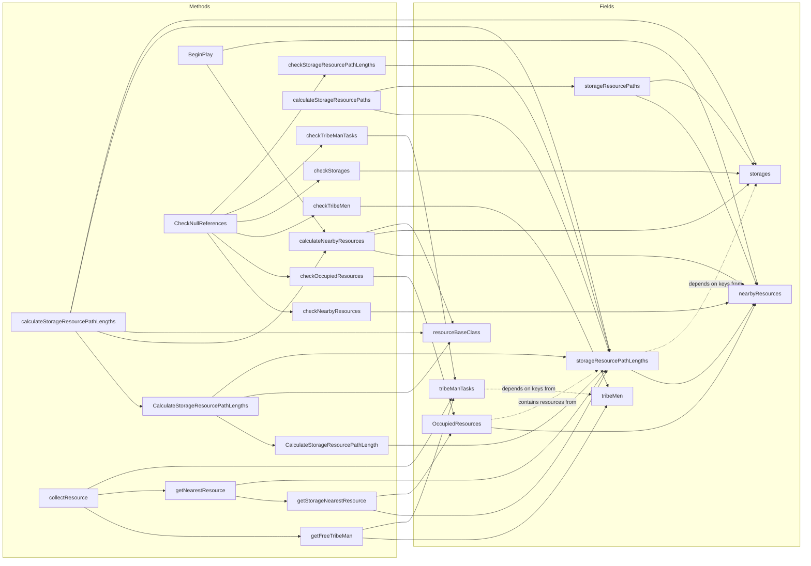

# TribeManager Dependencies

## Notes

- `tribeManTasks` depends on `tribeMen` keys.
- `storageResourcePathLengths` depends on `storages` keys.
- `collectResource` orchestrates free worker selection, resource selection, and task assignment.
- `calculateNearbyResources` populates `nearbyResources` via sphere overlap for each storage within 10 km.
- `calculateStorageResourcePaths` flattens `storageResourcePathLengths` into a flat sorted array `storageResourcePaths`; call it after async path queries have completed.
- `BeginPlay` calls `calculateNearbyResources` on game start and logs the result.
- `CheckNullReferences` is the entry point for stale-reference cleanup; only runs the dependent checks if at least one entry was removed from `nearbyResources`, `tribeMen` or `storages`.
- `checkNearbyResources`, `checkOccupiedResources`, `checkTribeMen`, `checkStorages`, `checkTribeManTasks`, `checkStorageResourcePathLengths` each clean a single collection and return whether any entry was removed.
